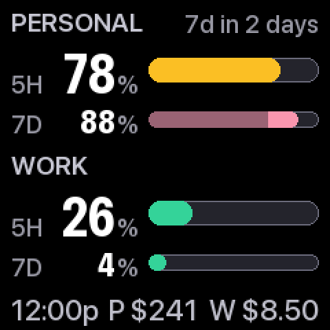
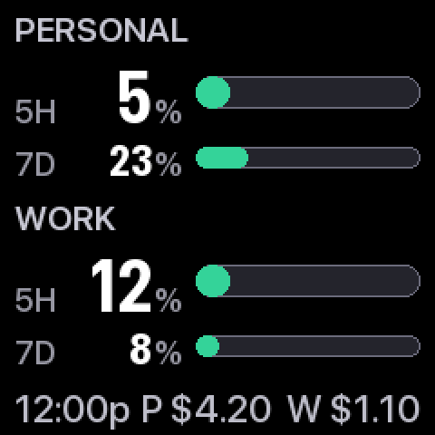
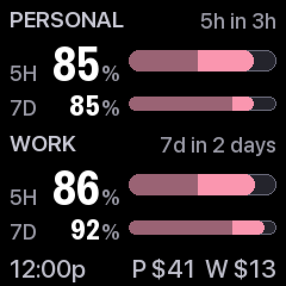
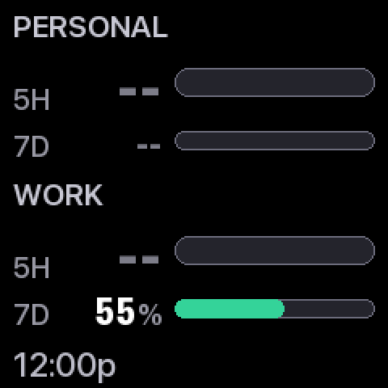
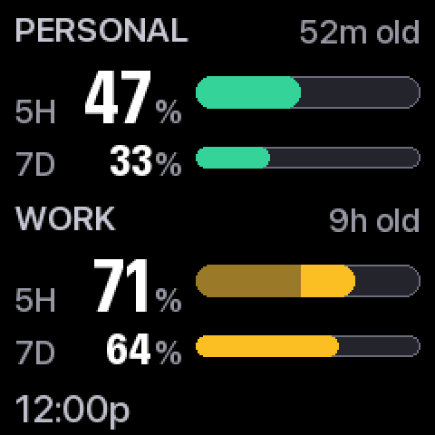
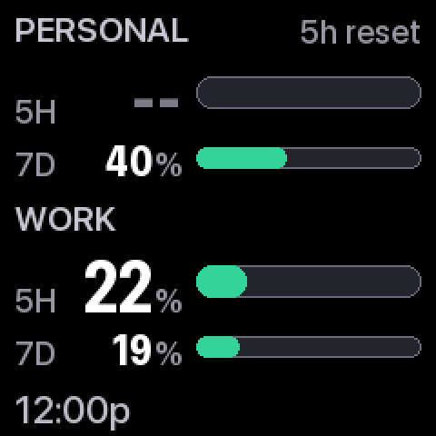

# clawdtv

Your Claude usage limits, on a tiny screen on your desk.


A $20 GeekMagic SmallTV Pro sits next to your keyboard. Every five minutes,
your Mac reads how much of your Claude 5-hour and weekly limits you've used and
pushes a fresh frame to it. One glance answers the question you keep tabbing
away to check: *how much runway do I have?*

Works with **one or two** Claude accounts (say, personal and work). The screen
runs stock firmware and is never modified — unplug it or run the kill script
and everything is back the way it was.

## What you need

- A **GeekMagic SmallTV Pro** — a 240×240 Wi-Fi photo-frame gadget, commonly
  $20–35 on AliExpress or Amazon. (The larger SmallTV Ultra should work too,
  with `theme = 3` in the config, but is untested.)
- A **Mac** that's awake while you work. Everything runs locally on it.
- **Claude Code** signed in with a Claude subscription (Pro or Max) — that's
  where the usage numbers come from.
- For the optional cost line: **Node.js** (the `npx` command).

## Set it up

**1. Put the screen on your Wi-Fi** — follow the leaflet in the box. Note the
IP address it shows (something like `192.168.1.50`; your router's device list
has it too).

**2. Download this repo** — click the green **Code** button above →
**Download ZIP**, and unzip it. Then open Terminal, type `cd ` (with a space),
drag the unzipped folder onto the window, and press return. (Or
`git clone` it, if that's your thing.)

**3. Install:**

```bash
bash tools/setup.sh
```

**4. Tell it where your screen is** — open `config.toml` in any text editor
and set the IP from step 1:

```toml
[device]
host = "192.168.1.50"
```

**5. Check everything:**

```bash
./.venv/bin/clawdtv check
```

It verifies the screen, your login, the usage data, and the display palette,
and tells you exactly which piece is unhappy if one is.

**6. Start it:**

```bash
bash tools/install.sh
```

That's it. The screen updates every five minutes from now on, surviving
reboots and sleep, until you say otherwise.

### A second account

One account uses the whole screen; add a second and the display splits into
two panels. Each account is one Claude Code "config dir". Sign in to the
second one once:

```bash
CLAUDE_CONFIG_DIR=/Users/you/.claude-work claude
```

then `/login` inside it, and uncomment the second `[[accounts]]` block in
`config.toml`. The path must be absolute — `config.toml` explains why.

## Reading the screen



Each account has two bars: **5H** is the 5-hour window that stops you
mid-afternoon, **7D** is the weekly cap. All bars share one scale, so their
lengths compare directly. The footer shows the frame time and today's cost
per account.

| | |
|---|---|
|  | **Green means go.** Under 60% used, nothing to say. `$4.20` in the corner is what today's usage would have cost at API prices — a consumption meter, not a bill. |
|  | **Amber, with relief in sight.** Past 60%, a bar turns amber and its reset time joins the header — `5h in 42m` means that window empties 42 minutes from now. Durations round *up*: relief arriving early is a pleasant surprise, the reverse is a lie. |
|  | **The bar is a pressure gauge.** When you're burning faster than the window will last, the bar splits: the sustainable portion dims, the excess stays lit. A plain solid bar means your pace is fine — being under budget doesn't need a graphic. |
|  | **Coral means decide.** Past 85% you're choosing what's worth the remaining budget. Color is never the only signal — the number and bar length say the same thing, so it survives JPEG compression and red-green colorblindness. |
|  | **`--` means unknown** — deliberately not `0%`. "You've used nothing" is the most dangerous thing to say when the truth is "I don't know." |
|  | **Old data says so, in words.** If a reading is stale, the header spells out its age rather than hoping you notice a dimmer gray. |
|  | **A window that rolled over** shows `5h reset` and `--` until the next fresh reading — the number it had describes a window that no longer exists. |
|  | **Problems are named.** `not logged in`, `token expired`, `no data` — the panel tells you which account needs attention and why. |
|  | **One account, full screen.** With a single `[[accounts]]` entry, the layout spreads out: bigger numerals, taller bars, same rules. |

### Every state

Every state the renderer can produce, at actual size — the honest way to review
a 240px design:


Regenerate with `python tools/assets.py`; the same list drives the automated
contrast tests, so a state that isn't pictured is a state nobody has checked.

## Turning it off

```bash
bash tools/kill.sh          # stop updating; the screen keeps its last frame
bash tools/kill.sh --purge  # also remove the agent and local state, clear our
                            # image off the device, and hand it back its clock
```

Both are pure bash — they work even when the Python side is broken, which is
exactly when you want a kill switch. Neither touches this folder, your Claude
logins, or your Keychain. Reinstall any time with `bash tools/install.sh`.

## When something breaks

Run `./.venv/bin/clawdtv check`. It tests each layer and names the broken one.

| Symptom | Likely fix |
|---|---|
| `unreachable at …` | Wrong IP, or the screen lost Wi-Fi. Give it a DHCP reservation in your router so the address stops moving. |
| Uploads succeed, screen never changes | Wrong `theme` number — `4` on the Pro, `3` on the Ultra. `check` compares it to the detected model. |
| `not logged in` on screen | Open Claude Code on that account once (`/login` if asked). |
| `token expired` on screen | Same — open Claude Code on that account; it refreshes its own token. |
| Cost shows nothing | Node/`npx` missing, or ccusage's price table fetch failed (bad totals are discarded rather than shown wrong). Harmless; disable in `[cost]` if unwanted. |
| Frame replaced by something else | Something else on your network pushes to the device too (a Home Assistant integration, say). `tools/watch_device.sh <ip>` catches it in the act. |

## How it works

```
launchd, every 5 minutes (config: tick_interval_s)
  └─ per account:  freshest of ─ statusline file (free, live during sessions)
                               ─ Claude Code's own cached usage
                               ─ the OAuth usage endpoint (rate-limited, cached)
     plus today's cost via ccusage (cached 15 min)
  └─ render one 240×240 JPEG → push over your LAN, skipped when unchanged
```

- **Credentials are read, never written.** clawdtv reads the OAuth token Claude
  Code already keeps in your macOS Keychain, uses it for one GET to Anthropic's
  usage endpoint, and never refreshes, stores, or logs it.
- **Nothing leaves your machine** except that usage lookup to Anthropic and the
  frame pushed to the screen on your own network.
- **Keepalive:** if an account sits idle long enough for its token to lapse, the
  panel would show `token expired`. Just before that, clawdtv runs the smallest
  possible Claude session (one word, Haiku) so Claude Code refreshes its own
  token — a few times a day, within rounding of $0. Turn it off in
  `[keepalive]` if you'd rather re-open Claude Code by hand.
- **The screen's flash is respected:** frames are pushed only when they change,
  never more than once per two minutes, and not during quiet hours. At this
  cadence the wear math is decades.
- Curious about the design — why the bars look like that, the WCAG contrast
  math, what was reverse-engineered? See [docs/DESIGN.md](docs/DESIGN.md).

**The unofficial parts.** The credential store, the usage endpoint, and the
device's HTTP quirks are all reverse-engineered and can drift — that's what
`clawdtv check` is for. clawdtv only *reads* usage; it runs no inference
through the token. The statusline and cache tiers are entirely first-party if
that distinction ever matters to you.

## AI disclosure

This project was designed, written, and tested with [Claude Code](https://claude.com/claude-code)
(Claude Opus), working with a human maintainer who directed the design, reviewed
the code, and exercised it against real hardware. The screenshots above are
generated by the renderer itself, and the display's legibility claims (WCAG
contrast, colorblind-safety, JPEG survival) are enforced by the automated test
suite rather than asserted.

## License

[MIT](LICENSE).
