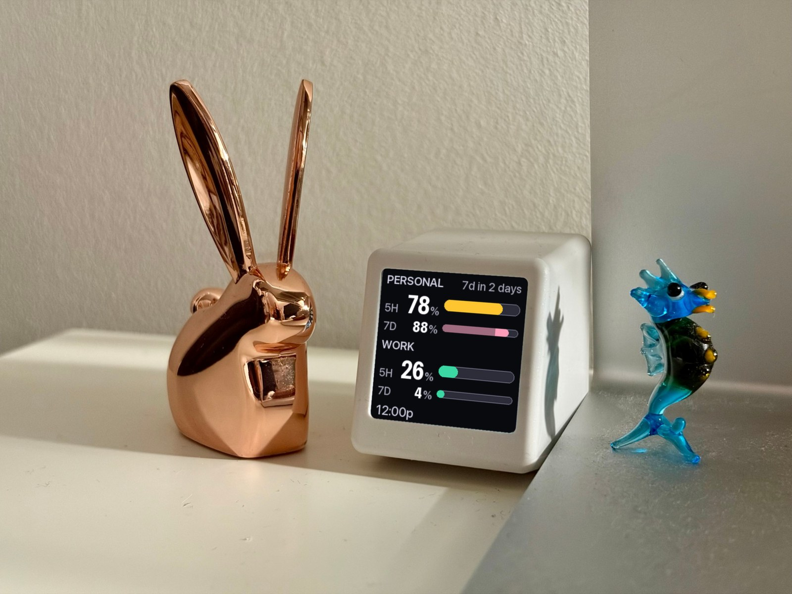
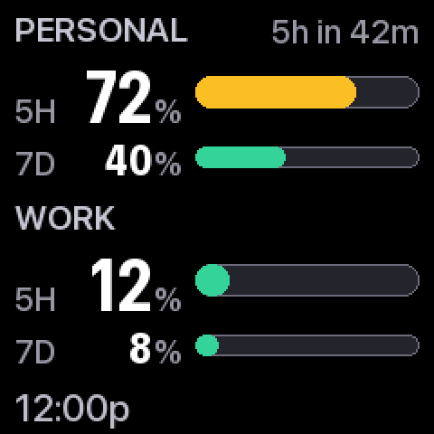
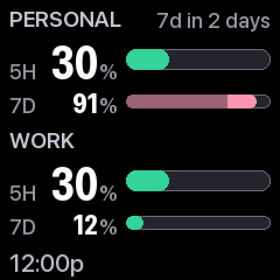
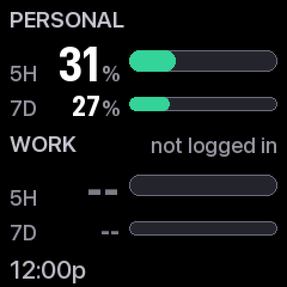
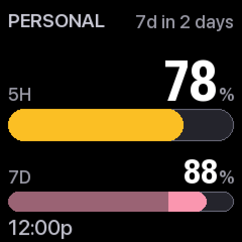
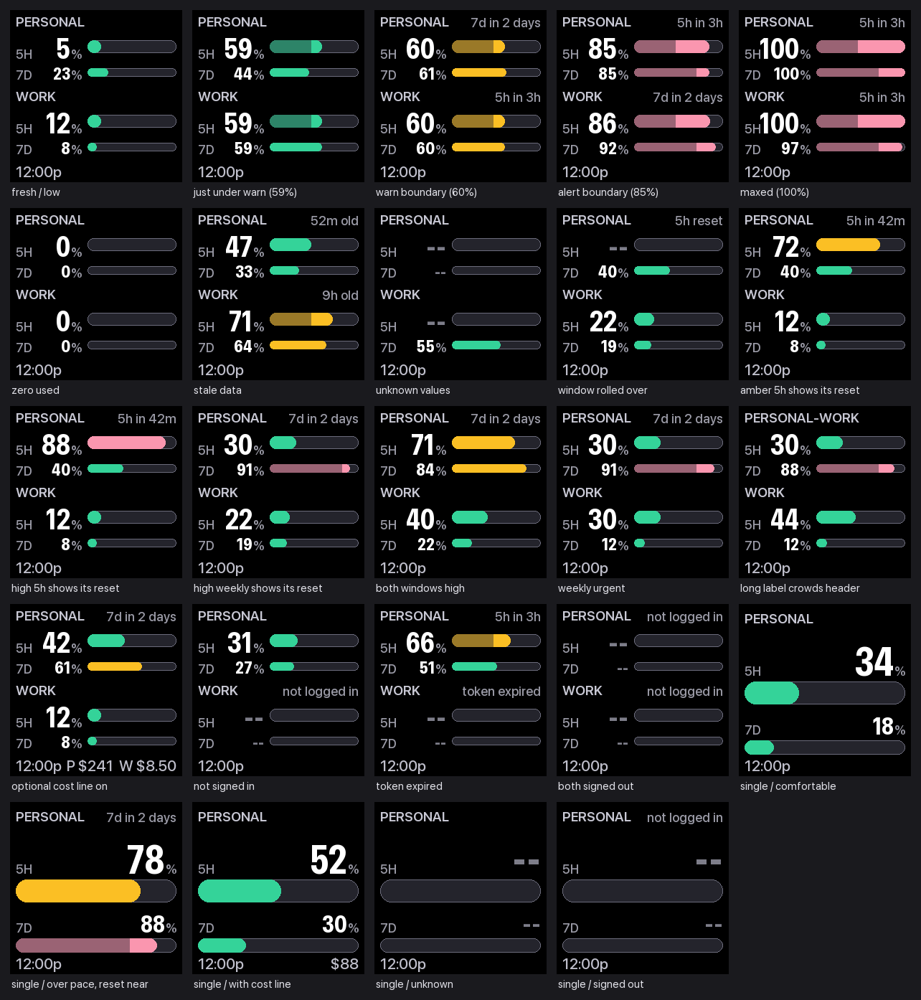

# clawdtv

Your Claude usage limits, on a tiny screen on your desk.



A $20 GeekMagic SmallTV Pro next to your keyboard, updated from your Mac every
five minutes. One glance answers: *how much runway do I have?* Tracks **one or
two** Claude accounts. The screen keeps its stock firmware — unplug it and it's
just a clock again.

## What you need

- A **GeekMagic SmallTV Pro** (240×240, ~$20–35 on AliExpress or Amazon)
- A **Mac** that's awake while you work
- **Claude Code** signed in with a Claude subscription (Pro or Max)

## Setup

**1.** Put the screen on your Wi-Fi (the leaflet in the box shows how) and note
its IP address.

**2.** Download this repo (green **Code** button → Download ZIP), open Terminal
in that folder, and run:

```bash
bash tools/setup.sh
```

**3.** Open `config.toml`, set the IP from step 1:

```toml
[device]
host = "192.168.1.50"
```

**4.** Start it:

```bash
bash tools/install.sh
```

That's it — the screen now updates every five minutes, through reboots and
sleep. If anything's unhappy, `./.venv/bin/clawdtv check` names the broken
piece.

**Second account?** Sign in once with
`CLAUDE_CONFIG_DIR=/Users/you/.claude-work claude`, then uncomment the second
`[[accounts]]` block in `config.toml`. One account uses the whole screen; two
split it.

## Reading it

**5H** is the 5-hour window, **7D** the weekly cap. All bars share one scale.
The dollar figures are optional and off by default — flip `[cost]` on in
`config.toml` (needs Node.js) to see today's usage priced at API rates: a
consumption meter, not a bill.

| | |
|---|---|
|  | **Amber past 60%**, and the reset time appears — `5h in 42m` is when that window empties. Coral past 85%. |
|  | **Burning too fast?** The bar splits: the sustainable part dims, the excess stays lit. A solid bar means your pace is fine. |
|  | **Problems are named** — `not logged in`, `token expired`, `52m old`. `--` means unknown, deliberately not `0%`. |
|  | **One account** gets the whole screen. |

<details>
<summary>Every state the renderer can produce</summary>

</details>

## Turning it off

```bash
bash tools/kill.sh          # stop; the screen keeps its last frame
```

```bash
bash tools/kill.sh --purge  # remove everything, hand the device back its clock
```

## Good to know

- Everything runs locally. Your Claude token is read from the Keychain, used
  for one usage lookup to Anthropic, never written or logged.
- An idle account's token is kept alive with a few one-word Haiku turns a day
  (pennies); turn that off under `[keepalive]` in `config.toml`.
- The usage endpoint is unofficial and can drift with Claude Code updates —
  `clawdtv check` tells you which part broke.

Design rationale, troubleshooting, and device findings: [docs/DESIGN.md](docs/DESIGN.md).

## AI disclosure

Designed, written, and tested with [Claude Code](https://claude.com/claude-code)
(Claude Opus), directed and reviewed by a human maintainer on real hardware.
The screenshots are generated by the renderer itself; the legibility claims
(WCAG contrast, colorblind-safety) are enforced by the test suite.

[MIT](LICENSE).
